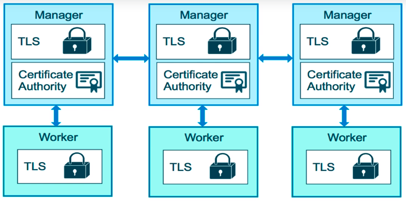

# Docker Swarm - Built-in Orchestration

Tendo as seguintes indagações...

- _"Containers everywhere = New problems"_
- Como automatizamos o ciclo de vida dos containers?
- Como escalamos?
- Como garantimos que containers recriam-se sozinhos quando falham?
- Como substituir containers sem downtime? _(blue/green deploy)_
- Como controlamos/rastrear onde os containers iniciaram?
- Como criar redes virtuais entre containers?
- Como garantir que somente servidores confiáveis rodem nossos containers?
- Como armazenar secrets, keys, passwords, e acessá-los através do container?

O Docker não é só um _"container runtime"_, através do **docker swarm**, traz uma solução de clusterização de containers, que através de uma única unidade gerencia múltiplos containers.

## Control Plan && Raft Group




## Example of Service with Multiple Containers


## Manager Task Workflow


## Comandos

Por padrão a funcionalidade de **swarm** não vem habilitada e pode-se conferir através do `docker info`.

Para ativa-la basta executar o comando `docker swarm init`

```log
Swarm initialized: current node (um7zkhbj6beq40w50ympgo8q1) is now a manager.

To add a worker to this swarm, run the following command:

    docker swarm join --token SWMTKN-1-1y29t59ourkqvorq4qkwi76qjxvdem5b18kb1q1uo4w46s60xz-9u75cfk4irkru9r9jskj4gshp 192.168.65.3:2377

To add a manager to this swarm, run 'docker swarm join-token manager' and follow the instructions.
```

Este comando é rápido e faz um monte de coisas, algumas delas são:

- Realiza varias operações relacionadas a [PKI (Public Key Infraestructure)](https://www.ibm.com/support/knowledgecenter/pt-br/SSFKSJ_8.0.0/com.ibm.mq.sec.doc/q009900_.htm)
  - Assina certificado root para o Swarm
  - Certificado é atribuido ao primeiro Manager node.
  - _Join tokens_ são criados

- Cria o **Raft Consensus Database** para armazenar configs, secrets, certificados, etc.
  - É encriptado por padrão no disco
  - Não é necessário algum seviço chave/valor de terceiro para armazenar secrets/configs da orquestração/automação de serviços
  - Replica logs aos managers através de mutual TLS no "control plane"

Verificar o Manager Node que foi criado automático na inicialização do swarm: `docker node ls`

```log
ID                            HOSTNAME                STATUS              AVAILABILITY        MANAGER STATUS      ENGINE VERSION
um7zkhbj6beq40w50ympgo8q1 *   linuxkit-00155df84979   Ready               Active              Leader              18.09.2
```

Percebe-se que está marcado MANAGER STATUS como Leader, e só é possível ter um manager neste status por vez.

Para verificar os comandos disponíveis de adicionar/remover/promover servers `docker node --help`

```log
demote      Demote one or more nodes from manager in the swarm
inspect     Display detailed information on one or more nodes
ls          List nodes in the swarm
promote     Promote one or more nodes to manager in the swarm
ps          List tasks running on one or more nodes, defaults to current node
rm          Remove one or more nodes from the swarm
update      Update a node
```

Para verificar os comandos disponíveis do swarm de inicializar/entrar/sair do swarm `docker swarm --help`

```log
ca          Display and rotate the root CA
init        Initialize a swarm
join        Join a swarm as a node and/or manager
join-token  Manage join tokens
leave       Leave the swarm
unlock      Unlock swarm
unlock-key  Manage the unlock key
update      Update the swarm
```

## Services

Diferente do comando `docker run`, temos agora o `docker service` que é direcionado à orquestração de serviços, diferente do run que é direcionado a host único.

Para verificar os comandos disponíveis `docker service --help`

```log
create      Create a new service
inspect     Display detailed information on one or more services
logs        Fetch the logs of a service or task
ls          List services
ps          List the tasks of one or more services
rm          Remove one or more services
rollback    Revert changes to a service's configuration
scale       Scale one or multiple replicated services
update      Update a service
```

### Exemplo

Inicializar um serviço com a imagem `alpine` e executar o comando ping no serviço de DNS do Google (8.8.8.8)

- `docker service create alpine ping 8.8.8.8`

Assim como o docker run, o comando acima retorna um token identificador do serviço.

Ao verificar os serviços inicializados, `docker service ls`, temos:

```log
ID                  NAME                MODE                REPLICAS            IMAGE               PORTS
rhup1cdyrp9g        quirky_cori         replicated          1/1                 alpine:latest
```

Percebe-se a coluna REPLICAS, que por padrão irá inicializar 1 replica no total de 1, e a missão primordial de um orquestrador é manter esta proporção sempre completa, ou seja, sempre tudo/tudo, todos os serviços rodando.

Para cada serviço, temos seus respectivos containers, e para verifica-los pode-se usar o comando `docker service ps {SERVICE_NAME/SERVICE_ID}` > `docker service ps rhup1cdyrp9g`

```log
ID                  NAME                IMAGE               NODE                    DESIRED STATE       CURRENT STATE           ERROR
   PORTS
tlkaj7kik9nb        quirky_cori.1       alpine:latest       linuxkit-00155df84979   Running             Running 3 minutes ago
```

Para aumentar o número de réplicas do service, utiliza-se `docker service update {SERVICE_NAME/SERVICE_ID} --replicas 3`

```log
overall progress: 3 out of 3 tasks
1/3: running   [==================================================>]
2/3: running   [==================================================>]
3/3: running   [==================================================>]
verify: Service converged
```

Verifica-se agora que possui 3 containers rodando devido ao número de replicas que foi aumentado `docker service ps quirky_cori`

```log
ID              NAME            IMAGE           NODE                    DESIRED STATE   CURRENT STATE   ERROR   PORTS
tlkaj7kik9nb    quirky_cori.1   alpine:latest   linuxkit-00155df84979   Running         Running 7 minutes ago
36686n9phviu    quirky_cori.2   alpine:latest   linuxkit-00155df84979   Running         Running 32 seconds ago
nk92vdj9y03n    quirky_cori.3   alpine:latest   linuxkit-00155df84979   Running         Running 31 seconds ago
```

Podemos configurar um monte propriedades dos serviços através do comando `docker service update --help`

Pode-se verificar que caso um container seja removido manualmente, o swarm se encarregará de subir uma nova replica. Para remover manualmente, pode-se usar o `docker container rm <CONTAINER_ID>`

Para remover os containers por definitivo, é necessário remover o serviço também. Para fazê-lo o comando é `docker service rm SERVICE_NAME`. Percebe-se que posteriormente uma automação remove os containers.

## Swarm Multi Node

Para criarmos um exemplo utilizando 03 nodes, precisaremos de 3 máquinas.

Podemos simular online através do [http://play-with-docker.com](http://play-with-docker.com), utilizar VirtualBox em conjunto com o Docker Machine ou Utilizar o serviço de clouds como Amazon, Azure, Google, Digital Ocean, etc.

- `docker node ls` Exibe lista dos nodes e quem é o Líder

- `docker node update --role manager node2`  Atualiza role do node2 para manager

## Multi-Host **Overlay** Networking

É uma network compartilhada para todos os hosts do swarm, chamada de **overlay**, opcionalmente permite configurar criptografia IPSec (AES), entre outras coisas.

É bastante utilizada para servir de interface entre serviços, os quais podem estar conectados a multiplas networks (ex: front-end, back-end), dependnedo do design.

### Exemplo Overlay

Para criar a rede overlay `docker network create --driver overlay mydrupal`

Para criar o serviço no node1 `docker service create --name psql --network mydrupal -e POSTGRES_PASSWORD=mypass postgres`

Para criar o serviço no node2 `docker service create --name drupal --network mydrupal -p 80:80 drupal`

## Scaling Out com Routing Mesh

- Funciona como um stateless load balancing
- É um OSI Layer 3 (TCP), não um Layer 4 (DNS)
- Stateful loadbalancer podem ser executados utilizando recursos como `nginx` or `HAProxy LB proxy`
- ... ou Docker Enterprise Edition que vem com o L4 web proxy embutido.


### Exemplo Routing Mesh

Criar serviço `docker service create --name search --repliaces 3 -p 9200:9200 elasticsearch:2`

Verificar os serviços criados `docker service ps search`

Testar o **load balancer** através do curl `curl localhost:9200` que irá cair em nos 3 serviços aleatóriamente.

## Assigment Swarm 1

- [Docker Swarm Assingment 1](swarm/assignments/swarm-app-1/README.md)

Para verificar os logs de todos os containers de todos os serviços foi utilizado uma feature ainda não liberada que é o comando `docker service logs`, normalmente é exigido o identificador do container.

## Swarm Stacks

É uma camada de abstração que aceita Compose files como definição declarativa para services, networks e volumes.

Utiliza o comando `docker stack deploy` em vez do `docker service create`.

Stacks gerenciam todos os objetivos, incluindo o network overlay por stack. Também é adicionado o nome da stack como prefixo de seus respectivos nomes.

É identificado através da **key** `deploy:` no Compose file. Não faz o `build:` pois agora estamos no cenário de **produção**, esta etapa de construção de imagem deve ser feita por um CI da vida.

**Resumindo, o compose ignore a key _deploy:_ e o swarm ignora a key _build:_**

`docker-compose` CLI não é necessária em um Swarm server.


[Docker Swarm Stack Stack Example 1](resources/docker-mastery/swarm-stack-1/example-voting-app-stack.yml)

Podemos fazer o deploy da stack acima através do comando `docker stack deploy -c example-voting-app-stack.yml voteapp`

Podemos então ter um overview dos serviços que estão rodando de determinada stack através do comando `docker stack services voteapp` ou `docker stack ps voteapp`, neste segundo, temos inclusive os nodes aos quais pertencem.

### Secrets Storage

É a maneira mais facil e segura para armazenar _secrets_ no Swarm.

O que é um _secret_? Username/passwords, certificados e chaves TLS, SSH keys, basicamente qualquer dado que seja preferivel que não esteja na capa de um jornal.

- Suporta strings ou binários até de 500Kb de tamanho.
- Raft Database é encriptada no disco.
- Só é armazenada nos nodes Managers.
- O padrão são Managers e Workers "control plane" é TLS + Mutual Auth
- Secrets são armazenados primeiro no Swarm, e depois atribuídos aos services.
- Somente containers atribuidos aos serviços acessar.
- Parecem arquivos no container, mas na verdade são um sistema de arquivo em memória. `/run/secrets/<secret_name/secret_alias>`
- Local docker-compose pode usar secrets como arquivos, mas não são seguros.

Para criar pode ser utilizado o comando `docker secret create psql_user psql_user.txt` ou `echo "myDBPassword" | docker secret create psql_pass -`

É possível inspecionar os _secrets_ através do comando `docker secret ls` e então `docker secret inspect psql_user`

Para criar um service manualmente mapeando para os secrets, pode-se utilizar o seguinte exemplo: `docker service create --name psql --secret psql_user --secret psql_user --secret psql_pass -e POSTGRES_PASSWORD_FILE=/run/secrets/psql_pass -e POSTGRES_USER_FILE=/run/secrets/psql_user postgres`

Um exemplo utilizando o stack compose [pode ser visto aqui](resources/docker-mastery/secrets-sample-2/docker-compose.yml)

## Full App Lifecycle with Compose

- Local `docker-compose up` development environment
- Remote `docker-compose up` CI environment
- Remote `docker stack deploy` production environment

[Exemplo pode ser encontrado nesta pasta](resources/docker-mastery/swarm-stack-3)

## Service Updates

- Prove recurso de substituição de tasks/containers de um service
- Limita o downtime (não previne, mas limita)
- Vai substituir o container na maior parte das alterações
- Possui um monte de opções no update, como vimos anteriormente.
- Inclui opções de rollbacks e healthcheck
- Também tem sub-comandos de scale & rollback para acesso rápido `docker service scale web=4` ou `docker service rollback web` sem especificar o `--rollback` por ser muito utilizado.
- Um stack deploy de mesmo nome, é considerado um update.

### Exemplos comuns

- Atualizar a imagem para uma nova versão `docker service update --image myapp:1.2.1 <service_name>`
- Adicionar uma variável de ambiente e remover uma porta em um unico comando `docker service update --env-add NODE_ENV=production --publish-rm 8080`
- Alterar o número de replicas de dois serviços em um unico comando`docker service scale web=8 api=6`

**Dica: se a stack possui múltiplos containers, que ao longo de seus ciclos de vidas são realocados em nodes, movidos, etc podem acabar sobrecarregando fisicamente um nó específico, o Swarm em si, não move os services entre nodes, e isso pode ser feito manualmente através de atualizações dos services, que ao re-deploy irá cair no nó que está com mais recurso disponível. Pode ser feito através do comando `docker service update --force web`**

## Healthchecks

- É suportado no Dockerfile, Compose YAML, docker run, e Swarm Services.
- Docker engine irá `exec` executar o comando no container (Ex: `curl localhost`)
  - A engine aguarda pelas seguintes respostas `exit 0` (OK) ou `exit 1` (Error)
- Existe somente 3 tipos de estados de container: starting, healthy e unhealthy.
- Os healthchecks em services, são executados em um intervalo de 30segundos.
- O status do healthcheck aparece no comando `docker container ls`
- Os ultimos 5 healthchecks aparecem no `docker container inspect`
- O docker run considera somente o primeiro de healthcheck na inicialização
- Services irão substituir as tasks caso o healthcheck falhe, tentando novamente provavelmente em um novo host, dependendo do scheduler.
- Service updates aguardam os healthchecks antes de proceder.

### Exemplos

Exemplo utilizando docker run `docker run --health-cmd="curl -f localhost:9200/_cluster/health || false" --health-interval=5s --health-retries=3 --health-timeout=2s --health-start-period=15s elasticsearch:2`

Exemplo no Dockerfile

- `--interval=DURATION` Default: 30s
- `--timeout=DURATION` Default: 30s
- `--start-period=DURATION`  Default: 0s
- `--retries=N` Default: 3

## Referências

- [Docker Docs - Deploy services to a swarm](https://docs.docker.com/engine/swarm/services/)
- [Docker Docs - Windows Hyper-V driver for docker-machine](https://docs.docker.com/machine/drivers/hyper-v/)
- [Docker Docs - Use swarm mode routing mesh](https://docs.docker.com/engine/swarm/ingress/)
- [Docker Docs - Features Not Supported In Stack Deploy](https://docs.docker.com/compose/compose-file/#not-supported-for-docker-stack-deploy)
- [Docker Docs - Manage sensitive data with Docker secrets (Lots of good reading and examples)](https://docs.docker.com/engine/swarm/secrets/)
- [Docker Docs - Secrets In Compose Files](https://docs.docker.com/compose/compose-file/#secrets-configuration-reference)
- [Docker Docs - Service Update command](https://docs.docker.com/engine/reference/commandline/service_update/)

___

- [Only one host for production, should I use docker-compose or Swarm](https://github.com/bretfisher/ama/issues/8)
- [My Examples of using Traefik with Swarm](https://github.com/bretfisher/dogvscat)
